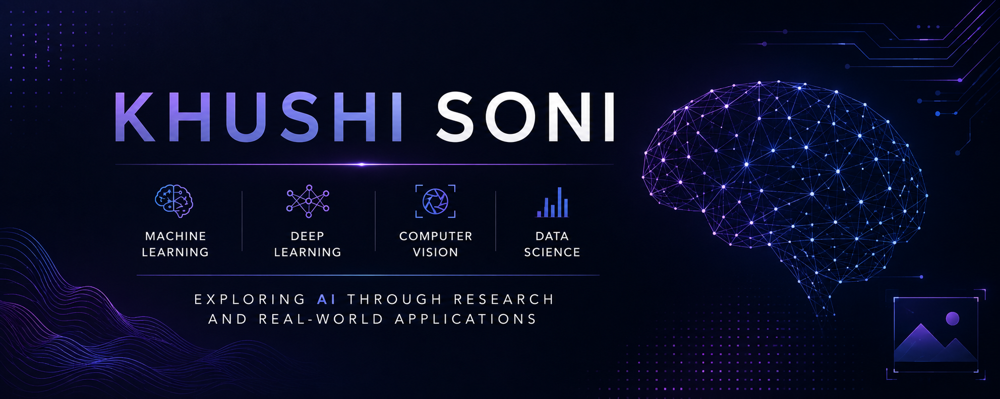

  

  

# Hi, I'm Khushi Soni

### B.Tech Computer Science & Engineering Student
Machine Learning • Deep Learning • Computer Vision • Generative AI

I'm a fourth-year Computer Science & Engineering student at COER University, Roorkee, with a strong interest in Artificial Intelligence, Machine Learning, Deep Learning, Computer Vision, and Generative AI.

I enjoy exploring how intelligent systems can solve real-world problems through data-driven approaches, experimentation, and continuous learning.
---

## About Me

* 🎓 Fourth-year B.Tech Computer Science & Engineering student at COER University, Roorkee
* 📅 Expected Graduation : 2027
* 🤖 Interested in AI, ML, DL, Computer Vision, and Generative AI.
* 🐍 Primarily working with Python for AI/ML development
* 📚 Continuously learning modern AI technologies, model development, and intelligent systems
* 🚀 Passionate about building solutions that create meaningful real-world impact

---

## Current Focus

- Machine Learning & Deep Learning
- Computer Vision Applications
- Generative AI & Large Language Models (LLMs)
- Retrieval-Augmented Generation (RAG)
- AI Agents and Automations
- Multimodal AI Systems
- Model Fine-tuning and Optimization
- Responsible AI and Ethical AI Systems

---

## Tech Stack

### Languages

### AI / Machine Learning / Deep Learning

### Data & Analytics

### Development & Deployment Tools

---

## Featured Projects

<table>
<tr>
<td width="50%">
  
### OsteoDetect
*Medical Imaging Innovation*
 
AI-powered Bone Tuberculosis detection from X-ray images using ResNet50 and Grad-CAM explainable AI. Achieved **95.69% accuracy** while providing visual explanations for clinical decision-making through heatmap visualizations.
 

 
[Repository](https://github.com/Khushisoni702/OsteoDetect)
 
</td>
<td width="50%">
  
### NeuroVision
*Medical Imaging Innovation*
 
Advanced brain tumor classification using MobileNetV2 to analyze MRI scans. Classifies 4 tumor categories with **96.54% accuracy**. Integrates Grad-CAM for visual interpretability of tumor regions in medical imaging.
 

 
[Repository](https://github.com/Khushisoni702/NeuroVision)
 
</td>
</tr>
<tr>
<td width="50%">
  
### GeoScope-AI
*Remote Sensing & GIS Innovation*
 
Intelligent satellite image classification using EfficientNetB0 for land-use analysis. Classifies 10 categories with **95.57% accuracy**. Features Streamlit web app with real-time predictions, confidence scores, and downloadable PDF reports.
 

 
[Repository](https://github.com/Khushisoni702/GeoScope-AI) | [Live Demo](https://geoscope-ai.streamlit.app/)
 
</td>
<td width="50%">
  
### ArrhythmiaNet
*Healthcare AI & Signal Processing*
 
Deep learning ECG arrhythmia classification using hybrid CNN-LSTM architecture. Classifies 5 heartbeat types with **98.61% accuracy**. Integrates SHAP-based explainability to visualize which ECG regions influenced predictions.
 

[Repository](https://github.com/Khushisoni702/ArrhythmiaNet)
 
</td>
</tr>
</table>

---

## Github Statistics

  

  

---

## Connect

  
  
  
  

---

## Beyond the Code

I am interested in understanding how intelligent systems learn and make decisions from data. I am currently exploring Generative AI concepts such as large language models, RAG, and fine-tuning, while strengthening my foundation in machine learning and deep learning. My focus is on building practical knowledge and gradually applying these concepts to real-world AI problems.

Open to AI/ML internships, research opportunities, and collaborations.
